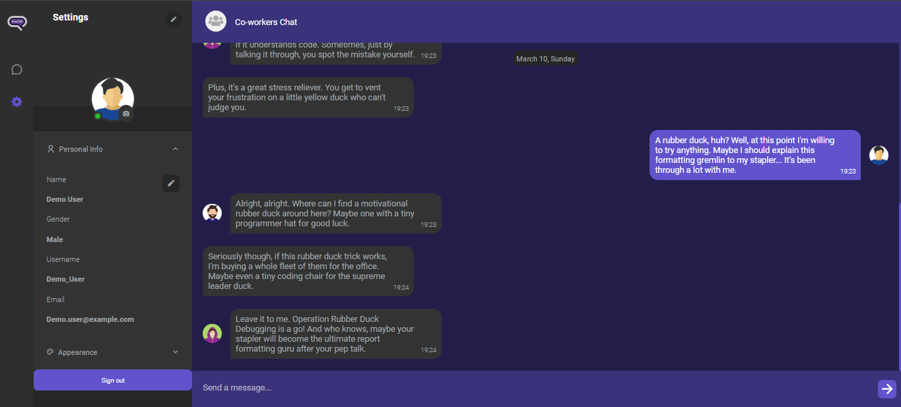

 

  

  <h3 align="center">Snap Talk</h3>

  

    Connect with friends, family, and colleagues effortlessly. Start meaningful conversations, share memorable moments,and stay connected wherever you are. Sign in now to begin your journey into the world of seamless communication.
     
     
    <a href="https://snap-talk.vercel.app/" target="_blank">View App</a>
  

## About The Project

 

## Built With

The project is built using mainly Angular + NestJS combination, You can see other technologies that were used under the repository 'about' section.

## Authors

* **Sergey Arzumanyan** - *Frontend Developer* - [Sergey Arzumanyan](https://github.com/SergeyArzumanyan/) - *Built The Project*
